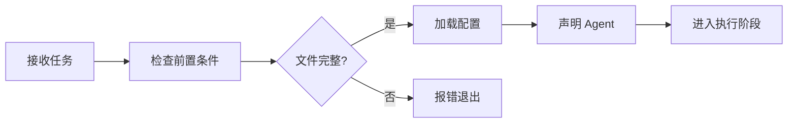
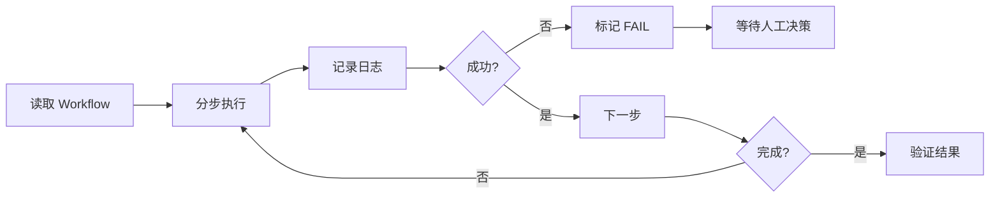
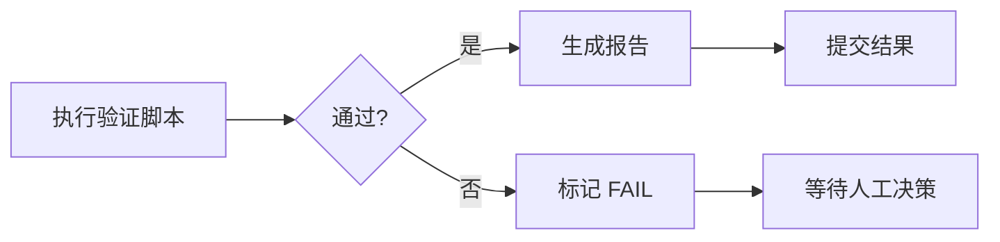
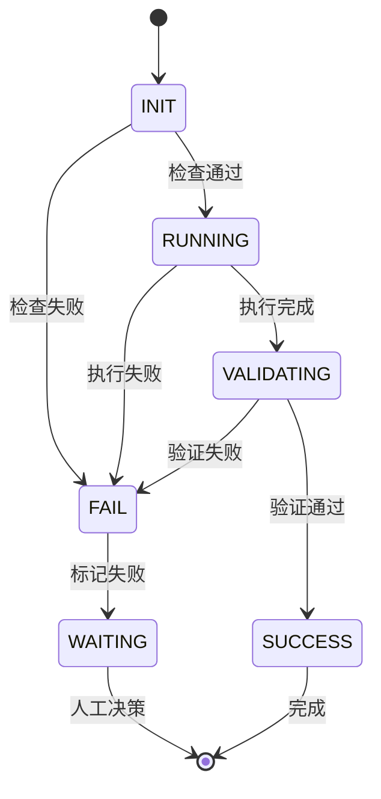

# AI Runner 执行器配置

## 📋 文档信息
- **版本**: v1.0
- **创建时间**: 2026-02-04
- **用途**: 定义 AI Agent 执行流程与环境配置

---

## 🎯 执行器概述

AI Runner 是 smart_media 项目的 AI Agent 执行引擎，负责：
- 任务调度与分发
- 执行环境管理
- 日志记录与监控
- 错误处理与回滚

---

## 🔧 环境配置

### 1. 项目路径
```yaml
project_root: c:\Users\24228\Desktop\smart_media
core_project: c:\Users\24228\Desktop\smart_media\quark_strm
```

### 2. 关键目录
```yaml
directories:
  rules: ai/rules/          # 规则文件
  state: ai/state/          # 状态文件
  logs: ai/logs/            # 执行日志
  workflows: .agent/workflows/  # Workflow 定义
```

### 3. 必需文件
```yaml
required_files:
  - ai/rules/agent.md       # Agent 规范
  - ai/runner.md            # Runner 配置（本文件）
  - ai/state/plan.md        # 当前计划
```

---

## 🚀 执行流程

### 阶段 1: 初始化


**检查项**:
- ✅ 必需文件存在
- ✅ Agent 角色声明
- ✅ 配置文件有效

### 阶段 2: 执行


**执行规则**:
- 📝 每步输出真实日志
- ⏱️ 超时自动退出
- ❌ 失败立即停止

### 阶段 3: 验证


**验证方式**:
- 🐍 Python 脚本优先
- 🖥️ 终端命令次选
- ⏱️ 超时时间: 30 秒

---

## 📊 日志规范

### 1. 日志级别
```python
LOG_LEVELS = {
    "DEBUG": "调试信息",
    "INFO": "常规信息",
    "WARNING": "警告信息",
    "ERROR": "错误信息",
    "CRITICAL": "严重错误"
}
```

### 2. 日志格式
```
[时间] [级别] [Agent] [阶段] 消息
```

**示例**:
```
[2026-02-04 02:48:00] [INFO] [Developer] [阶段1] 开始执行代码生成
[2026-02-04 02:48:05] [INFO] [Developer] [阶段1] 生成文件: app/services/new_service.py
[2026-02-04 02:48:10] [ERROR] [Developer] [阶段1] 导入失败: ModuleNotFoundError
```

### 3. 日志存储
```yaml
log_storage:
  path: ai/logs/
  format: "{date}_{agent}_{stage}.log"
  retention: 30  # 保留天数
```

---

## 🔄 任务调度

### 1. 任务队列
```python
TASK_QUEUE = {
    "pending": [],      # 待执行
    "running": [],      # 执行中
    "completed": [],    # 已完成
    "failed": []        # 失败
}
```

### 2. 优先级
```python
PRIORITY = {
    "P0": 0,  # 最高优先级（系统性任务）
    "P1": 1,  # 高优先级（核心功能）
    "P2": 2,  # 中优先级（优化改进）
    "P3": 3,  # 低优先级（非紧急）
}
```

### 3. 并发控制
```yaml
concurrency:
  max_agents: 1        # 同时运行的 Agent 数量
  max_retries: 0       # 最大重试次数（禁止自动重试）
  timeout: 300         # 超时时间（秒）
```

---

## ⚙️ Agent 配置

### 1. Agent 能力矩阵
```yaml
agents:
  Architect:
    capabilities:
      - 架构设计
      - 技术选型
      - 依赖分析
    max_complexity: 10
    
  Developer:
    capabilities:
      - 代码实现
      - 单元测试
      - 代码注释
    max_complexity: 8
    
  Tester:
    capabilities:
      - 测试设计
      - 测试执行
      - Bug 报告
    max_complexity: 6
    
  DevOps:
    capabilities:
      - 环境配置
      - 部署脚本
      - 监控告警
    max_complexity: 7
```

### 2. Agent 切换规则
```yaml
switch_rules:
  - 必须在阶段边界切换
  - 必须完成当前阶段验证
  - 必须生成交接文档
```

---

## 🛡️ 错误处理

### 1. 错误分类
```python
ERROR_TYPES = {
    "SYNTAX_ERROR": "语法错误",
    "IMPORT_ERROR": "导入错误",
    "RUNTIME_ERROR": "运行时错误",
    "TIMEOUT_ERROR": "超时错误",
    "VALIDATION_ERROR": "验证错误"
}
```

### 2. 处理策略
```yaml
error_handling:
  SYNTAX_ERROR:
    action: FAIL
    notify: true
    
  IMPORT_ERROR:
    action: FAIL
    notify: true
    
  RUNTIME_ERROR:
    action: FAIL
    notify: true
    
  TIMEOUT_ERROR:
    action: FAIL
    notify: true
    
  VALIDATION_ERROR:
    action: FAIL
    notify: true
```

### 3. 回滚机制
```yaml
rollback:
  enabled: true
  auto_backup: true
  backup_path: backup/
  git_commit: true
```

---

## 📈 监控指标

### 1. 性能指标
```yaml
metrics:
  execution_time: true      # 执行时间
  success_rate: true        # 成功率
  error_count: true         # 错误次数
  code_quality: true        # 代码质量
```

### 2. 质量指标
```yaml
quality:
  test_coverage: 80%        # 测试覆盖率目标
  code_complexity: 10       # 最大复杂度
  documentation: required   # 文档要求
```

---

## 🔐 安全配置

### 1. 权限控制
```yaml
permissions:
  read: ["ai/", "quark_strm/"]
  write: ["ai/logs/", "ai/state/"]
  execute: ["scripts/"]
  forbidden: [".git/", "node_modules/"]
```

### 2. 敏感信息
```yaml
sensitive:
  api_keys: masked          # API 密钥脱敏
  passwords: masked         # 密码脱敏
  tokens: masked            # Token 脱敏
```

---

## 🚦 状态管理

### 1. 执行状态
```python
EXECUTION_STATES = {
    "INIT": "初始化",
    "RUNNING": "执行中",
    "VALIDATING": "验证中",
    "SUCCESS": "成功",
    "FAIL": "失败",
    "WAITING": "等待人工决策"
}
```

### 2. 状态转换


---

## 📝 配置示例

### 完整配置文件
```yaml
# AI Runner 配置
runner:
  version: "1.0"
  project: "smart_media"
  
environment:
  project_root: "c:\\Users\\24228\\Desktop\\smart_media"
  core_project: "c:\\Users\\24228\\Desktop\\smart_media\\quark_strm"
  
directories:
  rules: "ai/rules/"
  state: "ai/state/"
  logs: "ai/logs/"
  workflows: ".agent/workflows/"
  
execution:
  max_agents: 1
  max_retries: 0
  timeout: 300
  
logging:
  level: "INFO"
  path: "ai/logs/"
  retention: 30
  
security:
  permissions:
    read: ["ai/", "quark_strm/"]
    write: ["ai/logs/", "ai/state/"]
    execute: ["scripts/"]
```

---

**维护者**: AI Engineering Team  
**最后更新**: 2026-02-04
